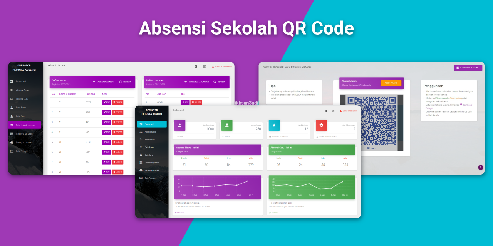

# Sistem Absensi Sekolah Berbasis QR Code

[](https://github.com/ikhsan3adi/absensi-sekolah-qr-code/actions/workflows/ci.yml)
[](https://github.com/ikhsan3adi/absensi-sekolah-qr-code/stargazers)
[](https://github.com/ikhsan3adi/absensi-sekolah-qr-code/network/members)
[](https://opensource.org/licenses/MIT)
[](https://www.php.net/)
[](https://codeigniter.com/)



## Deskripsi

Sistem Absensi Sekolah Berbasis QR Code adalah solusi teknologi informasi yang dirancang untuk mengotomatisasi proses absensi di lingkungan pendidikan. Sistem ini memanfaatkan teknologi QR code untuk memfasilitasi pencatatan kehadiran siswa dan guru secara efisien, akurat, dan real-time.

Aplikasi dikembangkan menggunakan framework CodeIgniter 4 dengan arsitektur MVC yang bersih dan terstruktur, memastikan maintainability dan scalability untuk pengembangan lebih lanjut.

## Daftar Isi

- [Fitur Utama](#fitur-utama)
- [Teknologi yang Digunakan](#teknologi-yang-digunakan)
- [Instalasi](#instalasi)
- [Konfigurasi](#konfigurasi)
- [Panduan Penggunaan](#panduan-penggunaan)
- [Kontribusi](#kontribusi)
- [Lisensi](#lisensi)

## Fitur Utama

### Fitur Sistem
- **Sistem Scanning QR Code**: Validasi otomatis QR code unik untuk setiap siswa/guru.
- **Notifikasi Presensi**: Integrasi dengan WhatsApp API untuk notifikasi real-time kepada siswa/guru.
- **Manajemen Pengguna**: Sistem autentikasi berbasis peran (role-based access control).
- **Dashboard Analitik**: Visualisasi data kehadiran dengan grafik dan statistik yang informatif.
- **Manajemen Data Absensi**: Modifikasi status kehadiran (hadir, sakit, izin, tanpa keterangan).
- **Sistem Laporan**: Generasi laporan PDF dengan filter tanggal dan kategori.
- **Import Data Massal**: Impor data siswa dalam jumlah banyak melalui format CSV.

### Fitur Administratif
- **Manajemen Siswa**: Operasi CRUD (Create, Read, Update, Delete) data siswa.
- **Manajemen Guru**: Operasi CRUD data guru.
- **Manajemen Kelas**: Operasi CRUD data kelas dan jurusan.
- **Manajemen Petugas**: Operasi CRUD data petugas (khusus superadmin).
- **Pengaturan Sistem**: Konfigurasi nama sekolah, tahun ajaran, logo, dan lain-lain.

## Teknologi yang Digunakan

### Backend
- [CodeIgniter 4](https://github.com/codeigniter4/CodeIgniter4) - Framework PHP
- [Myth Auth Library](https://github.com/lonnieezell/myth-auth) - Sistem autentikasi
- [Endroid QR Code Generator](https://github.com/endroid/qr-code) - Generator QR Code

### Frontend
- [Material Dashboard Bootstrap 4](https://www.creative-tim.com/product/material-dashboard-bs4) - UI Framework
- [ZXing JS QR Code Scanner](https://github.com/zxing-js/library) - QR Code Scanner

### API & Integrasi
- [Fonnte](https://fonnte.com/) - WhatsApp API untuk notifikasi

### Database
- MySQL/MariaDB

## Instalasi

### Persyaratan Sistem
- PHP 8.1+
- MySQL/MariaDB
- Composer
- Web Server (Apache/Nginx)
- Extension PHP: `intl`, `gd`, `mysqli`

### Langkah-langkah Instalasi

1.  **Clone Repository**
    ```bash
    git clone https://github.com/ikhsan3adi/absensi-sekolah-qr-code.git
    cd absensi-sekolah-qr-code
    ```

2.  **Install Dependencies**
    ```bash
    composer install
    ```

3.  **Konfigurasi Environment**
    Salin file template `.env.example` menjadi `.env`.
    ```bash
    cp .env.example .env
    ```

4.  **Setup Database**
    - Buat database baru pada MySQL/MariaDB (misalnya: `db_absensi`).
    - Sesuaikan konfigurasi koneksi database pada file `.env`.

5.  **Migrasi Database**
    Jalankan perintah berikut untuk membuat struktur tabel yang diperlukan.
    ```bash
    php spark migrate --all
    ```

6.  **Jalankan Aplikasi**
    Gunakan server bawaan PHP atau server web pilihan Anda.
    ```bash
    php spark serve
    ```

7.  **Akses Aplikasi**
    - Buka browser dan navigasi ke `http://localhost:8080`.
    - Login dengan kredensial default:
      - **Username**: `superadmin`
      - **Password**: `superadmin`

## Konfigurasi

### Konfigurasi Umum
- Sesuaikan `baseURL` pada file `.env` sesuai dengan environment Anda.
- Konfigurasi koneksi database pada file `.env`.

### Konfigurasi Notifikasi WhatsApp
1.  Aktifkan notifikasi WhatsApp pada file `.env`:
    ```ini
    WA_NOTIFICATION=true
    ```
2.  Masukkan token WhatsApp API dari penyedia layanan (Fonnte):
    ```ini
    WHATSAPP_PROVIDER=Fonnte
    WHATSAPP_TOKEN=YOUR_TOKEN_HERE
    ```
    > **Catatan**: Untuk mendapatkan token, daftar di [Fonnte](https://md.fonnte.com/new/register.php), daftarkan device Anda, dan dapatkan token dari [dashboard Fonnte](https://docs.fonnte.com/token-api-key/).

### Konfigurasi Superadmin
Untuk mengubah kredensial superadmin, modifikasi file migrasi berikut:
`app\Database\Migrations\2023-08-18-000004_AddSuperadmin.php`

```php
// INSERT INITIAL SUPERADMIN
 $email = 'admin@example.com';
 $username = 'superadmin';
 $password = 'your_secure_password';